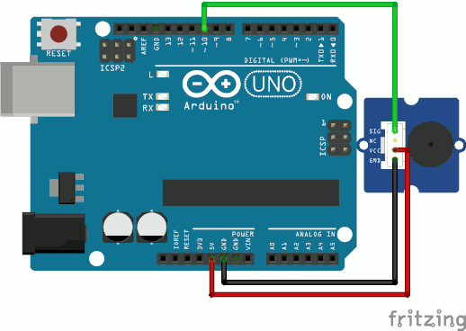
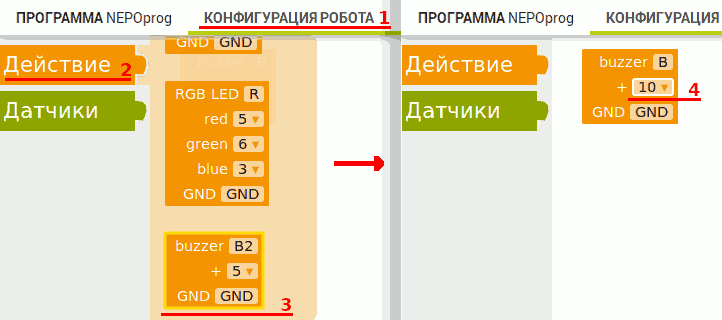
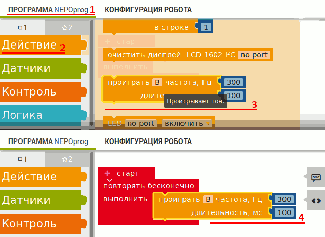

.. _buzzer:

Подключение зуммера
*******************

.. как пример использования физически другого средства вывода инфы

.. _buzzer-wire:

Подключение устройства к плате
==============================

Подключение зуммера к плате (см. рисунок ниже):

1. Подключаем питание устройства
   (контакты ``VCC`` -> ``+5V`` и ``GND`` -> ``GND``).
2. Подключаем сигнальный/управляющий контакт
   (``SIG`` или ``I/O`` к выводу ``10`` платы).

       Подключение зуммера к плате

.. _buzzer-code:

Настройка устройства в редакторе
================================

Добавление устройства в проект (см. рисунок ниже):

1. Открываем вкладку "КОНФИГУРАЦИЯ РОБОТА".
2. Выбираем компонент Действие > ``buzzer``.
3. Вытаскиваем его на рабочую область.
4. Выбираем номер порта, к которому подключён зуммер.

       Добавление зуммера в проект

Воспроизведение тона (см. рисунок ниже):

1. Открываем вкладку "ПРОГРАММА NEPOprog".
2. Выбираем компонент Действие > ``проиграть частота``.
3. Вытаскиваем его на рабочую область.
4. Настраиваем частоту и длятельность звучания ноты.

       Воспроизведение тона

.. _buzzer-homework:

Задание: простая мелодия
========================

Доработать программу из урока, чтобы она воспроизводила любую простую мелодию.
*Примеры мелодий можно поискать в интернете*
