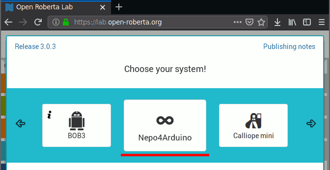
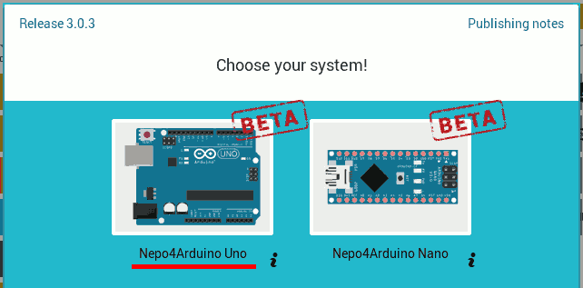
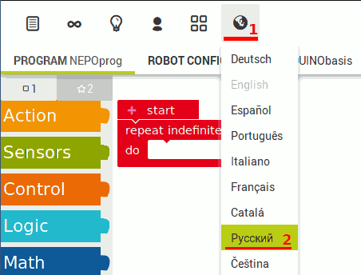
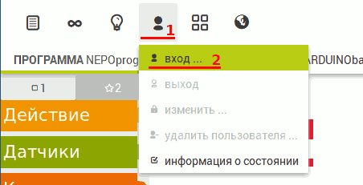
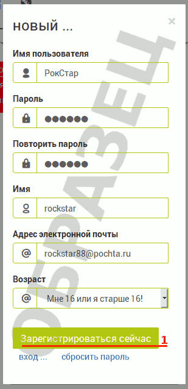

.. _editor:

Выбор и настройка редактора блоков
**********************************

.. _editor-choose:

Выбор редактора
===============

На момент написания этого раздела, в мире существовало, как минимум
3 хороших редактора блоков:

- Microsoft MakeCode [1]_
- Open Roberta [2]_
- Scratch [3]_

К сожалению мне не удалось найти готовое решение
для `MakeCode` и `Scratch`,
позволяющее легко и просто писать программы под Arduino.
В отличие это этих двух редакторов, `Open Roberta` умеет
работать с Arduino сразу "из коробки",
поэтому дальнейшая работа будет происходить в этом
редакторе.

----------

.. [1] Microsoft MakeCode - https://www.microsoft.com/en-us/makecode/
.. [2] Open Roberta - https://lab.open-roberta.org
.. [3] Scratch - https://scratch.mit.edu/about

.. _editor-setup:

Настройка редактора
===================

Для запуска редактора Open Roberta,
необходимо открыть страницу https://lab.open-roberta.org
в вашем любимом браузере FireFox или Chrome.

При запуске, Open Roberta предложит вырать тип проекта.
Нас будет интересовать **Nepo4Arduino Uno**:

       Выбор типа проекта

       Выбор используемой платы

После выбора типа проекта, для комфортной работы,
неплохо сделать первоначальную настройку редактора:

       Настройка языка интерфейса

Также, для упрощения сохранения созданных программ,
рекомендуется зарегистрироваться (создать учётную запись)
в Open Roberta:

       Регистрация нового пользователя (или вход, если запись была создана ранее)

       Ввод данных нового пользователя

.. .. _editor-layout:

.. Интерфейс редактора
.. ===================
