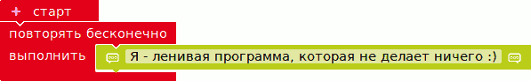

.. _blocks:

Программы из блоков
*******************

       Пример простой программы

На первых порах мы будем использовать
графический конструктор программ/алгоритмов с целью:

- упрощения написания программ
  и получения работающих программ как можно быстрее
- не отпугнуть начинающего разработчика необходимостью разбираться и учить
  сложный язык программирования

Использование графического конструктора программ можно сравнить с
созданием моделек из детского конструктора -
мы просто составляем подходящие блоки вместе для получения
желаемого результата.

===================

.. toctree::
   :maxdepth: 2

   editor
   blink
   buzzer
   serial
   branches
   state
