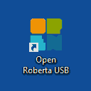
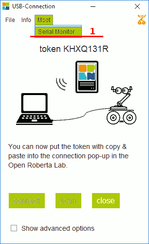
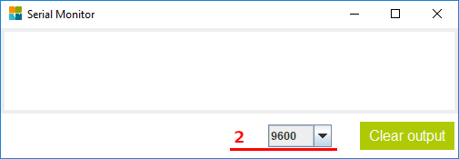

.. _serial:

Вывод сообщений на экран компьютера
***********************************

Иногда программа может вести себя не так, как задумали вы - её разработчик.
В таких случаях обычно бывает полезно посмотреть,
какие шаги выполняет программа, чтобы понять,
где она застопоривается или падает из-за ошибки.

И одно из самых простых и доступных средств сделать это -
вывод произвольных текстов на консоль.
Т.е. мы можем добавить в произвольных местах программы специальные блоки,
при выполнении которых программа будет отображать заданный текст
на экране компьютера/ноутбука.
Тем самым давая нам понять, какие блоки она выполнила
и в каком порядке.

.. _serial-setup:

Настройка программы-терминала
=============================

Для отображения сообщений на экране компьютера необходима
специальная программа - монитор порта или Serial Monitor.
Для запуска программы воспользуйтесь ярлыком `Open Roberta USB`:

       Запуск Open Roberta USB

Затем, в открывшемся окне, выберите пункт меню `Serial Monitor`:

       Открытие Serial Monitor

Убедитесь, что выбрана скорость 9600 бод
(Open Roberta использует это значение скорости по-умолчанию):

       Установка скорости соединения

.. _serial-logs:

Логирование команд
==================

В качестве примера, создадим простую программу,
выводящую приветствие на экран каждые 5 секунд:

.. figure:: serial-hello.png
       :align: center
       :alt: Пример программы для Serial Monitor

       Вывод приветствия

.. _serial-homework:

Задание: предупреждение о сирене в терминал
===================================================

Доработать задание из предыдущего урока,
добавив вывод сообщения "Внимание, сирена!" за 2 секунды до включения сирены.

.. tip:: Для того, чтобы, после вывода сообщения, сирена звучала дольше,
       в рамках этого урока можно просто скопировать и вставить
       несколько раз подряд команды/блоки воспроизведения звуков сирены.
